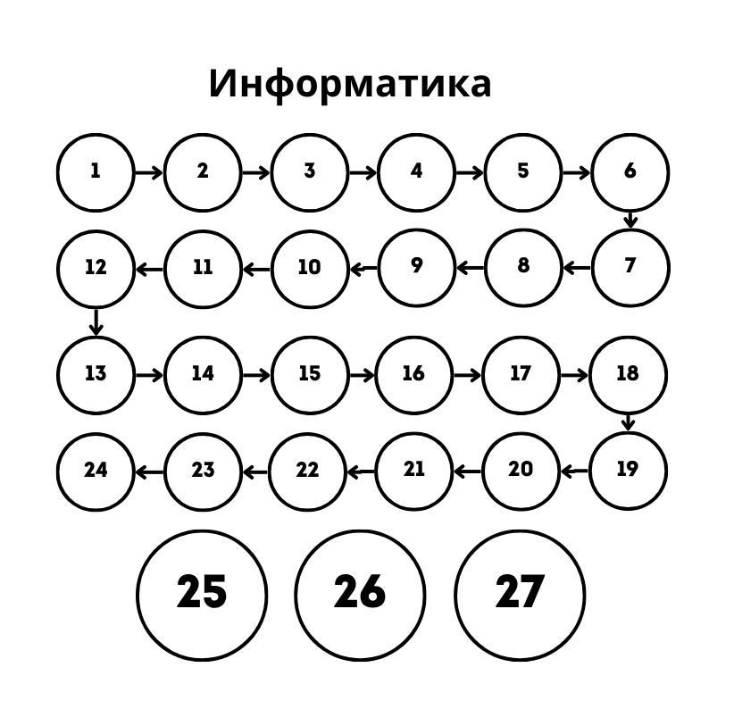

# Алгоритм для заданий

---



---

- [Алгоритм для заданий](#алгоритм-для-заданий)
    - [Номер 1 (Пути)](#номер-1-пути)
    - [Номер 2 (Таблица истиности)](#номер-2-таблица-истиности)
    - [Номер 3 (Поиск в exel)](#номер-3-поиск-в-exel)
    - [Номер 4 (Фано)](#номер-4-фано)
    - [Номер 5 (Поиск в другой системе счесления)](#номер-5-поиск-в-другой-системе-счесления)
    - [Номер 6 (Черепаха)](#номер-6-черепаха)
    - [Номер 7 (Подсчет звука и видео)](#номер-7-подсчет-звука-и-видео)
    - [Номер 8 (Поиск среди комбинации симолов)](#номер-8-поиск-среди-комбинации-симолов)
    - [Номер 9 (Поиск строки в exel)](#номер-9-поиск-строки-в-exel)
    - [Номер 10 (Поиск слова в ворде)](#номер-10-поиск-слова-в-ворде)

---

### Номер 1 (Пути)
1. Сопоставляем все пути таблицы с фактическими на рисунке
2. Находим то что просили по заданию

---

### [Номер 2](Шаблоны/Ex2.py) (Таблица истиности)
1. Пишем функцию для составлния таблицы
2. Сопотавляем таблицы из задания и нашум

---

### Номер 3 (Поиск в exel)
1. Фильтруем таблицу по необходимому значению
2. По необходимоти ипользуем ВПР
```
=ВПР("Иванов"; Имя!A2:C10; 2; ЛОЖЬ)
          |         |       |    |
    Что ищем    Где ищем    |  Флаг что ищем точное совпадение
                    Из какого столбца
```
3. Выбераем необходимое значение

---

### Номер 4 (Фано)
1. Внимательно смотрим на условие, где-то просят чтобы оставалось под еще элементы, где-то только для имеющихся, где-то не должно быть выполнено Фано
2. Делаем двоичное дерево и расставляем значения

---

### [Номер 5](Шаблоны/Ex5.py) (Поиск в другой системе счесления)
1. Определяем систему счесления
2. Если основание 2 то просто конвертируем через bin, 
если другая то пишем функцию конвертации
3. Подаем на вход валидации числа от 1 до примерно 1000
4. Выбераем ответ какой требуют в задании

---

### [Номер 6](Шаблоны/Ex6.py) (Черепаха)
1. Инициализируем черепаху
2. Прописываем все движегния черпахи
3. Отрисовываем сетку точек
4. Подсчтываем то что требуют

### Номер 7 (Подсчет звука и видео)

1. Определяем тип задания, их два:
   1. Задание со звуком
   2. Задание с изображением
2. Для заданий по изображениям
>V(размер фото) = (Ширирна * Высоту) * I
N(количество цветов) = 2^i
I - глубина кодирования
3. Для заданий на звук
>V(размер звуквого файла) = K * I * L * K
K - моно или стерео
L - частота дискритизации в гц
I - глубина кодирвоания
T - время в сек
4. Если речь идет про видео то к звуку добавляеться изображение.
5. Делаем подсчет и пишем ответ

---

### [Номер 8](Шаблоны/Ex8.py) (Поиск среди комбинации симолов)
1. Составляем алфаит и сортируем его
2. C помощью itertools перебираем все возможные последовательности
3. Если символы могут повторяться то функция product, если только перестановки то функция permutation 
4. Среди этих последовательностей ищем подходящие по условию

---

### [Номер 9](Шаблоны/Ex9.py) (Поиск строки в exel)
1. Копируем таблицу в txt файл
2. Перебираем построчно весь файл и ищем нужную строку по условию

---

### Номер 10 (Поиск слова в ворде)
1. Комбинацией сtrl + F открываем поле поиска по файлу
2. Учитывая задания далаем фильтры на регистр, только слово целиком и тд.