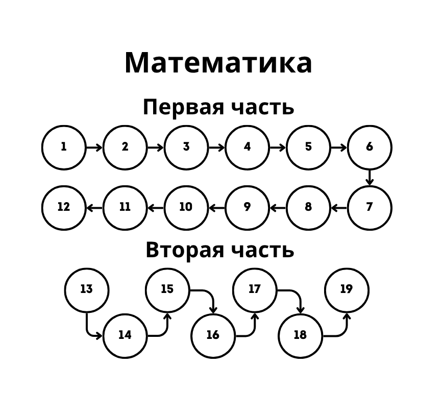

# Алгоритм для заданий

---

---

- [Алгоритм для заданий](#алгоритм-для-заданий)
    - [Номер 1 (Простая планиметрия)](#номер-1-простая-планиметрия)
    - [Номер 2 (Вектора)](#номер-2-вектора)
    - [Номер 3 (Простая стереометрия)](#номер-3-простая-стереометрия)
    - [Номер 4 (Простая вероятность)](#номер-4-простая-вероятность)
    - [Номер 5 (Сложная вероятность)](#номер-5-сложная-вероятность)
    - [Номер 6 (Простые уравнения)](#номер-6-простые-уравнения)
    - [Номер 7 (Упрощение выражений)](#номер-7-упрощение-выражений)
    - [Номер 8 (График производной)](#номер-8-график-производной)
    - [Номер 9 (Физическая формула)](#номер-9-физическая-формула)
    - [Номер 10 (Текстовая задача)](#номер-10-текстовая-задача)
    - [Номер 11 (Анализ графика)](#номер-11-анализ-графика)
    - [Номер 12 (Поиск экстремумов)](#номер-12-поиск-экстремумов)

---

### Номер 1 (Простая планиметрия)
1. Определить тип задания:
    - Треугольник
    - Параллелограм
    - Центральный и вписанный угол
    - Вписанный четырехугольник
    - Касательная
2. [Теория по планику](Материалы/Планик.pdf)

---

### Номер 2 (Вектора)
1. Определяем тип задания 
   - Найти длину вектора
   - Найти скалярное произведение векторов
2. [Теория по векторам](Материалы/Вектора.pdf)

---

### Номер 3 (Простая стереометрия)
1. Определить тип задания
    - Призма
    - Пирамида
    - Цилиндр и конус
    - Шар
2. [Теория к стереометрии](Материалы/Стереометрия.pdf)
3. [Объемы и площади](Материалы/Объемы%20и%20площади.pdf)

---

### Номер 4 (Простая вероятность)
1. Определить тип задания:
    - Класическая вероятность
    - Вероятность противоположных событий
2. [Теория по вероятности](Материалы/Вероятность.pdf)

---

### Номер 5 (Сложная вероятность)
1. Определить тип задания:
   - Независимые события
   - Зависимые события
2. [Теория по вероятности](Материалы/Вероятность.pdf)

---

### Номер 6 (Простые уравнения)
1. Определить тип задания:
    - Показательные
    - Иррациональные
    - Логарифмические
    - Степенные 
    - Рациональные
2. [Теория по степеням и логарифмам](Материалы/Степени%20и%20логарифмы.pdf)

---

### Номер 7 (Упрощение выражений)

1. Определить тип задания:
    - Степени и корни
    - Логарифмы
    - Тригонометрия
2. [Теория по степеням и логарифмам](Материалы/Степени%20и%20логарифмы.pdf)
3. [Теория по тригоноиметрии](Материалы/Трига.pdf)

---

### Номер 8 (График производной)
1. Определить тип задания:
    - Анализ графика функции
2. [Теория график производной](Материалы/График%20производной.pdf)

---

### Номер 9 (Физическая формула)
1. Определить тип задания:
    - Дробно-линейная зависимость
    - Квадратичная зависимось
    - Тригономерическая зависимость
    - Показательная зависимость
    - Логарифмическая зависимость

---

### Номер 10 (Текстовая задача)
1. Определить тип задания:
    - Процентные вычисления
    - Движение вдоль прямой
    - Работа
    - Движение по воде
2. [Теория по текстовым задачам](Материалы/Текстовая%20задача.pdf)

---

### Номер 11 (Анализ графика)
1. Определить тип задания:
    - Прямая
    - Парабола
    - Гипербола
    - Квадратный корень
    - Показательная функция
    - Логарифмическая функция
2. [Теория по графикам функций](Материалы/Графики%20функций.pdf)

---

### Номер 12 (Поиск экстремумов)
1. Определить тип задания:
    - Степенная функция
    - Натуральный логарифм
    - Экспонента
    - Тригонометрические функции
2. [Теория для поиска экстремумов](Материалы/Поиск%20экстремума.pdf)

---